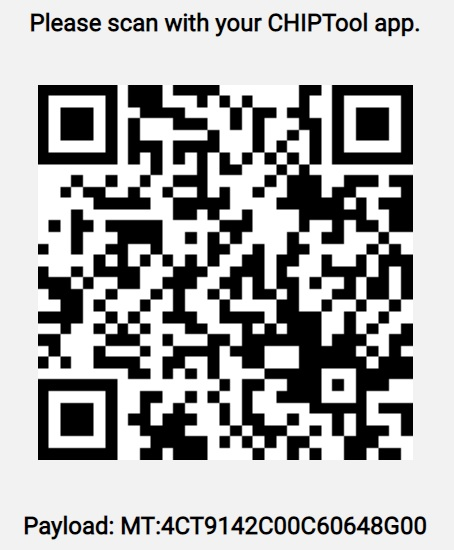
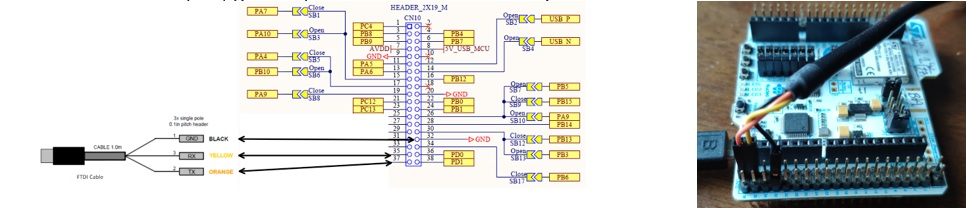
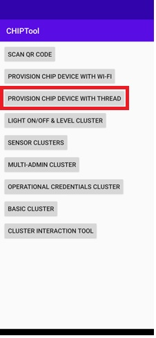
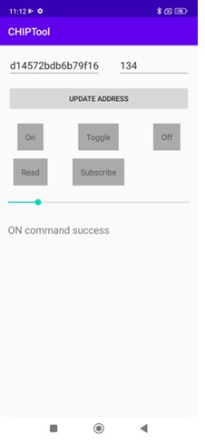

# STM32WB Matter Device Over Thread MCU Firmware Package

## Overview

The matter device over thread package shows several matter end device sample applications. 
    Those examples are based on [Matter](https://github.com/project-chip/connectedhomeip) and behave as a Matter accessory communicating
	over a 802.15.4 Thread network. It can be paired into an existing matter network and can be controlled by this network.	

This Hotspot FW package includes:
* Application example under "Projects\P-NUCLEO-WB55.Nucleo\Applications\Matter" called Lighting-App.     	
* Application example under "Projects\P-NUCLEO-WB55.Nucleo\Applications\Matter" called Window-App.  
* Application example under "Projects\STM32WB5MM-DK\Applications\Matter" called Lighting-App.  
* Application example under "Projects\STM32WB5MM-DK\Applications\Matter" called Window-App.    
    
    

### <b>Keywords</b>

MATTER, CHIP, Connectedhomeip, IoT, Internet of Things, Network, Connectivity, FreeRTOS, LwIP, commissioning, CSA, Connectivity Standard Alliance,
STM32 , P-NUCLEO-WB55 , STM32WB5MM-DK, OpenThread, BLE. 

## Release note

Details about the content of this release are available in the release note [here](https://htmlpreview.github.io/?https://github.com/stm32-hotspot/stm32wb-matter-device-over-thread/blob/main/Release_Notes.html).

## Boards Needed
  * as Matter accessory P-NUCLEO-WB55 or STM32WB5MM-DK
    * [NUCLEO-WB55RG](https://www.st.com/en/evaluation-tools/nucleo-wb55rg.html)
    * [STM32WB5MM-DK](https://www.st.com/en/evaluation-tools/stm32wb5mm-dk.html)
  * as Thread RCP firmware P-NUCLEO-WB55  ST Radio Co-Processor (RCP) if used
    * [NUCLEO-WB55RG](https://www.st.com/en/evaluation-tools/nucleo-wb55rg.html) 
	
 
## Requirements
The STM32WB5MM-DK and P-NUCLEO-WB55 are complete development platform, based on Arm® Cortex®-M4 and Arm® Cortex®-M0+ cores.
Those examples are based on BLE and Thread protocol working in concurrent mode.

See the process to load the wireless stack [here](https://wiki.st.com/stm32mcu/wiki/Connectivity:STM32WB_BLE_Hardware_Setup).

To make the program work, you must do the following:
  * Open STM32CubeIDE toolchain version >= 1.9.0 is required.
  * Build the desired application and load your image.
  * Flash the application and Thread RCP binary(if needed) with [STM32CubeProgrammer](https://www.st.com/en/development-tools/stm32cubeprog.html) version >= 2.9.0
    both at address 0x08000000.
  * If needed, install the CHIPTool .apk on an Android from Utilities/APK Smartphone (see below).
  * If using the onboarding payload for commissioning, use this QR code:

     
 

## Setting up the environment
In a matter ecosystem with an end device over thread , a thread border router is required. You can use one of the following combinations 

  * Follow those [guides](https://openthread.io/guides/border-router/raspberry-pi) to install the OpenThread Border Router (OTBR)
    on Raspberry Pi platform.
	 * if using the Radio Co-Processor(RCP) design from ST, flash the binary from Project/P-NUCLEO-WB55.Nucleo/Binary_Thread_RCP/ with
     the right Copro Wireless Binary and connect the P-NUCLEO-WB55 to Raspberry Pi 4(recommended) as follow:
     Communication with the Raspberry Pi 4 is done through a serial connection. UART Rx/Tx are routed to 
     external connector Cn10 pin35(Tx) and pin 37(Rx). So please use a FTDI cable do to the connection.
      
       
	 
	 * Or follow this [link](https://openthread.io/platforms/co-processor) and use this example to setup your own RCP.

  * Or use a border router available in the market

### Using Android CHIPTool 

   * Install and setup Android Application:

     Open the Settings app on your Android device 

     In the Settings menu, tap Apps.

     Tap Special app access(or Advanced > Special app access)

     Tap Install unknown apps

     Select the Chip-toolAPK V1.1 from the file management apps.

     Tap the Allow from this source slider to allow APK files to be installed.

     Allow CHIPTool to access the device's location and to take pictures and record video.
     If you have Android 12 or higher allow app to find and connect to nearby devices.

     CHIPTool offers the following features:
      * Scan the Matter QR code and display payload information to the user.
      * Commission a Matter device
      * Send echo request to the Matter echo server
      * Send ON/OFF cluster requests to a Matter device 

    Click on "PROVISION CHIP DEVICE WITH THREAD" and scan the QR Code to start the commissioning.
     
   

    Click on "LIGHT ON/OFF & LEVEL CLUSTER" to control the LED when the commissioning is complete.
 

    Note: Android CHIPTool cannot be used for the Window-App application.

### Bluetooth LE advertising

In this example, to commission the device onto a Matter network, it must be
discoverable over Bluetooth LE. After powering up the device, the device will advertise
automatically for 30 seconds. After this delay, you will need to reset the device to start
the commissioning procedure.

### Bluetooth LE rendezvous    

In Matter, the commissioning procedure is done over Bluetooth LE between a
Matter device and the Matter controller(here the Android app), where the controller has the
commissioner role.

To start the rendezvous, the controller must get the commissioning information
from the Matter device. The data payload is encoded within a QR code, printed to
the UART console. 

### Thread provisioning    

The provisioning operation, which is the Last part of the rendezvous procedure,
involves sending the Thread network credentials from the Matter
controller to the Matter device. As a result, the device joins the Thread network
via a OpenThread border Router (OTBR) and can communicate with other devices in the network.

### P-NUCLEO-WB55

The blue LED is ON when the BLE rendezvous started.
The green LED is ON when the board joined a thread network.
The red LED is used when using "LIGHT ON/OFF & LEVEL CLUSTER" on Android phone.

### STM32WB5MM-DK
The LCD screen displays "BLE connected" when the BLE rendezvous started.
The LCD screen displays "Network Join" when the board joins thread network.
The LCD screen displays "LED ON" + the light level when using "LIGHT ON/OFF & LEVEL CLUSTER" and pressing "On" and erase this line when pressing "Off" on Android phone.

## Known issues

-   SRP cache on the OpenThread border router needs to be flushed each time a new
    commissioning process is attempted. For this, factory reset the device by pressing SW1 or B1 for at least 10sec, then do a hardware
    reset then reset the RCP device or execute in the raspberry terminal ot-ctl srp server disable ; ot-ctl srp server enable, then restart the Android application . After this step, the commissioning process of the device can start.
-   Due to some MDNS issues, the commissioning with some Wi-Fi access point may fail.
-   The upstream application build is supported on Windows, MacOS and Linux. However the package itself has only been tested on a Windows 10 host.

## Troubleshooting

**Caution**: 
  * OTA is currently not supported by ST.
  * Android application has only been tested on arm64 smartphone CPU architecture.

**For any other question** related to the product, the hardware performance or characteristics, the tools, the environment, you can submit it to the **ST Community** on the STM32 MCUs related [page](https://community.st.com/s/topic/0TO0X000000BSqSWAW/stm32-mcus).